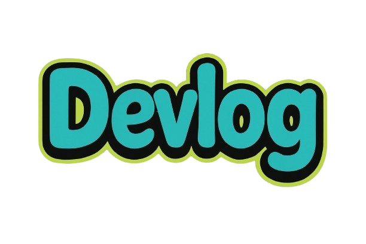

# Devlog

<p align="center">
    
</p>

<p align="center">
    <strong>Documenting the journey of development.</strong>
</p>

## About

Devlog is a platform built for developers to document their coding journey, share technical insights, and build their professional portfolio. It serves as a central hub for tracking progress and showcasing projects.

Our mission is to create a collaborative environment where knowledge is shared freely.

## Features

*   **Log Your Journey**: Document your daily coding progress, challenges faced, and solutions found to keep track of your growth.
*   **Share Insights**: Publish your technical learnings, snippets, and tutorials to help others in the developer community.
*   **Build Portfolio**: Showcase your consistency, growth, and completed projects to potential employers and collaborators.

## Tech Stack
gi
*   **Framework**: [Laravel](https://laravel.com)
*   **Styling**: [Tailwind CSS](https://tailwindcss.com)
*   **Interactivity**: [Alpine.js](https://alpinejs.dev)
*   **Build Tool**: [Vite](https://vitejs.dev)

## Installation

1.  **Clone the repository**
    ```bash
    git clone https://github.com/YOUR_USERNAME/Devlog.git
    cd Devlog
    ```

2.  **Install Dependencies**
    ```bash
    composer install
    npm install
    ```

3.  **Environment Setup**
    ```bash
    cp .env.example .env
    php artisan key:generate
    ```

4.  **Run the Application**
    ```bash
    npm run dev
    php artisan serve
    ```
